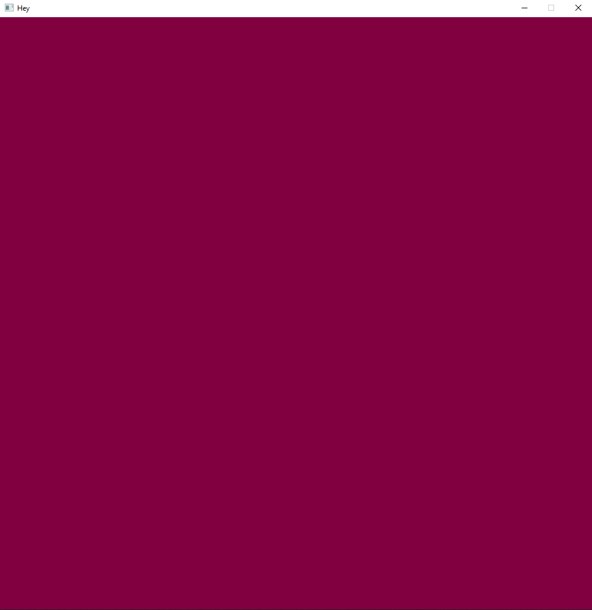

<h2 align="center">
🖥 3D Rendering with SDL2 🖥
</h2>

### Intro:
This is a SOP (Studie Område Projekt or Study Area Project in english).

...
Where the goal is to get a program to render a spinning cube.

... Developed with C++ using SDL2

### Goal:
- [x] Install and link SDL2.
- [x] Get a window on screen.
- [ ] .
- [ ] .
- [ ] A spinning cube.

 

<h2 align="center">References</h2>

 
<h4>
<a href="https://gamefromscratch.com/vcpkg-cpp-easy-mode-step-by-step-tutorial/">
SDL2 installation guide using vcpkg
</a>
</h4>

 

<h2 align="center">Dev log</h2>

 

<h3><b>16/Aug 2021</b></h3>

<h4>I got a window with a different color than white or black on the screen. and made some changes the directories. </h4>

<h4>Here is the current file tree: </h4>
<pre>
Repo
│   .gitignore
│   CMakeLists.txt
│   main.cpp
│   README.md
│
├───.vscode
│       launch.json
│       settings.json
│
├───res
│   │   SDL2.png
│   │
│   └───DevPic
│           SDL2_WindowWColor.png
│
└───src
    │   CMakeLists.txt
    │
    └───render
        └───window
                win.cpp
                win.h
</pre>

<!--
 

<h3><b>DATE/MONTH 2021</b></h3>

<h4>TEXT... </h4>

<h4>Here is the current file tree: </h4>
<pre>
tree /t
in the bash terminal in the root directory. 
</pre>

-->

